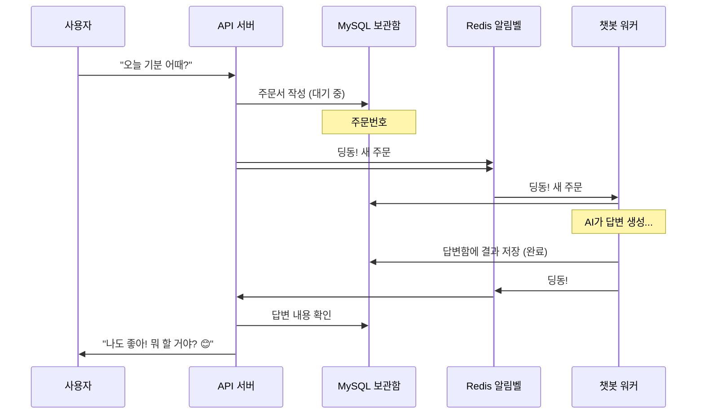

# 채팅 메시지 처리 흐름

사용자 메시지 한 건이 API → MySQL 큐 → Redis 알림 → 챗봇 워커 → 응답까지 처리되는 순서입니다.

```mermaid
sequenceDiagram
    participant U as 사용자
    participant API as API 서버
    participant DB as MySQL 보관함
    participant R as Redis 알림벨
    participant W as 챗봇 워커

    U->>API: "오늘 기분 어때?"
    API->>DB: 주문서 작성 (대기 중)
    Note over DB: 주문번호 #42<br/>메시지 저장
    API->>R: 딩동! 새 주문 #42
    API->>R: #42 답 나올 때까지 대기...

    R->>W: 딩동! 새 주문 #42
    W->>DB: #42 주문서 꺼냄 (처리 중으로 변경)
    Note over W: AI가 답변 생성...
    W->>DB: 답변함에 결과 저장 (완료)
    W->>R: 딩동! #42 답변 완료

    R->>API: #42 완료됐어요!
    API->>DB: 답변 내용 확인
    API->>U: "나도 좋아! 뭐 할 거야? 😊"
```
