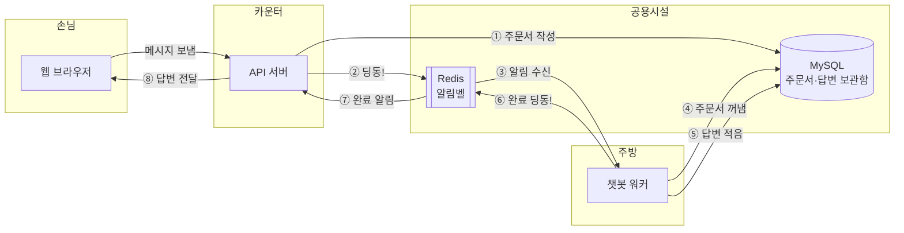

# 채팅 시스템 구성도

웹 브라우저, API 서버, 챗봇 워커, MySQL·Redis가 어떻게 연결되는지 한눈에 보는 흐름도입니다.

```mermaid
flowchart LR
    subgraph 손님
        A[웹 브라우저]
    end

    subgraph 카운터
        B[API 서버]
    end

    subgraph 주방
        C[챗봇 워커]
    end

    subgraph 공용시설
        D[(MySQL<br/>주문서·답변 보관함)]
        E[[Redis<br/>알림벨]]
    end

    A -->|메시지 보냄| B
    B -->|① 주문서 작성| D
    B -->|② 딩동!| E
    E -->|③ 알림 수신| C
    C -->|④ 주문서 꺼냄| D
    C -->|⑤ 답변 적음| D
    C -->|⑥ 완료 딩동!| E
    E -->|⑦ 완료 알림| B
    B -->|⑧ 답변 전달| A
```
